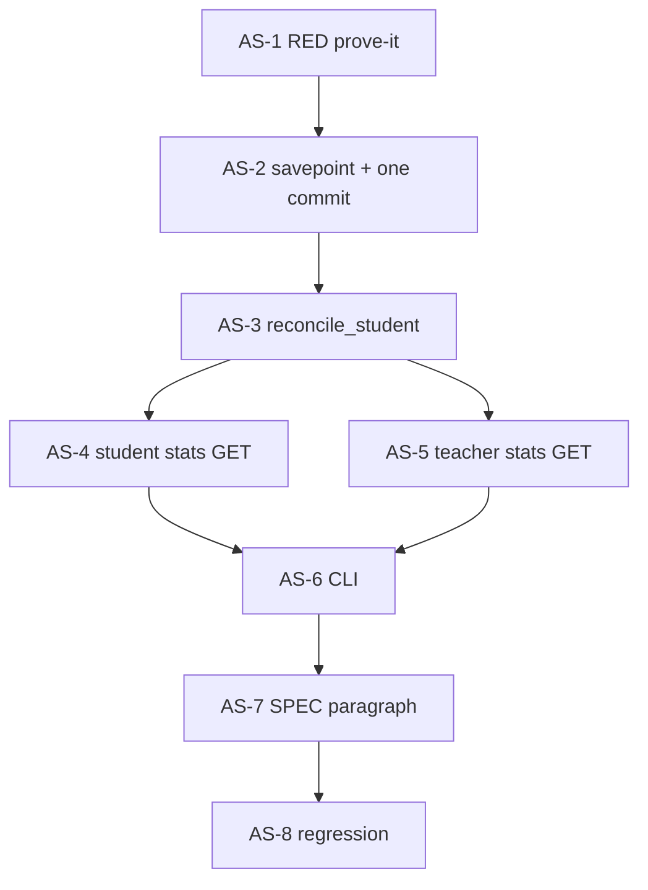

# Implementation Plan: Savepoint activity + reconcile

> **PLAN approved 2026-08-15** (человек: «все устраивает» по C1–C3). A1–A15 приняты. IMPLEMENT с AS-1.  
> Handoff для нового окна: [`docs/handoffs/activity-savepoint-reconcile.md`](../docs/handoffs/activity-savepoint-reconcile.md)

**Источник:** [`docs/specs/activity-savepoint-reconcile.md`](../docs/specs/activity-savepoint-reconcile.md) · idea: [`docs/ideas/activity-savepoint-reconcile.md`](../docs/ideas/activity-savepoint-reconcile.md)  
**Дата плана:** 2026-08-15  
**Статус:** ✅ IMPLEMENT AS-1…AS-7; AS-8 — полный pytest: 618 passed, 1 failed вне среза (`test_leads`)  
**Skills:** incremental-implementation → TDD  
**Коммиты:** только по явной просьбе пользователя  
**Baseline (HEAD):** `_run_activity_hook` / `run_activity_hook` делают `commit()` + `rollback()`; `submit` и `check_step` коммитят домен **до** хука; `GET …/stats` не догоняет ledger; CLI reconcile нет.

### Progress

| Task | Статус |
|------|--------|
| AS-1 Prove-it RED: hook failure + no hook commit/rollback | ✅ |
| AS-2 GREEN: savepoint hook + one outer commit | ✅ |
| AS-3 Reconcile service (TDD) | ✅ |
| AS-4 Student `GET /me/stats` heal + commit | ✅ |
| AS-5 Teacher `GET /students/stats` heal + commit | ✅ |
| AS-6 CLI `reconcile_activity` dry-run / `--apply` | ✅ |
| AS-7 Docs: SPEC §1.8 paragraph + spec/plan status | ✅ |
| AS-8 Regression sweep | частично |

---

## Overview

Хирургический срез: сдача ДЗ и проверка шага коммитятся **один раз**. Начисление баллов — во вложенном `begin_nested()` (SAVEPOINT): ошибка activity не делает `rollback` внешней сессии и не стирает работу ученика. Дыры `HOMEWORK_COMPLETE` / `STEP_CORRECT` закрывает `reconcile_student` на `GET /api/students/me/stats`, `GET /api/teacher/students/stats` и CLI `python -m app.cli.reconcile_activity` (dry-run по умолчанию, запись только с `--apply`). Frontend, Alembic, `get_db()` UoW, delta/streak backfill и heal на leaderboard — **не** в этом PR.

---

## Architecture Decisions

| Решение | Выбор | Почему |
|---------|--------|--------|
| Владение транзакцией | Хуки **без** `commit`/`rollback`; один `await self._session.commit()` после хука в `submit` / `check_step` | Spec §5 / §9; второй commit + rollback той же сессии — баг аудита [A1] |
| Баллы | `async with session.begin_nested(): await action()`; exception → лог, savepoint откатывается, домен жив | A3: сдача обязательна, баллы best-effort |
| Общий хук | Меняем `SessionAdapterBase.run_activity_hook` **и** `HomeworkSubmitService._run_activity_hook` одинаково | Один инвариант; не плодим третий helper |
| `check_step` | Только `exam_adapter` + `custom_adapter`. Homework-сессии идут через facade → эти два | У `HomeworkSessionAdapter` **нет** `check_step` (конфликт со spec §4 — см. Conflicts) |
| `complete_session` commit | **Переставить** существующий `commit()` **после** хука в exam/custom/homework `complete_session` | Следствие смены общего хука: иначе `add_session_minutes` останется в незакоммиченной транзакции и `test_complete_session_records_duration_minutes` упадёт. Не меняем attach/reopen/create (A11) |
| Догонка | `ActivityService.reconcile_student(student_id) -> int` | Spec §5; имя `reconcile_*`, не `fix_*` |
| Типы событий | Только отсутствующие `HOMEWORK_COMPLETE` и `STEP_CORRECT` | A5, A13; delta/streak/minutes/onboarding не сканируем |
| Баллы ДЗ при дыре | Одно событие `compute_homework_points(answered_steps, total_steps)` с текущего submission | A13; цепочку delta не восстанавливаем |
| `occurred_at` | `HomeworkSubmission.submitted_at` / `TestSessionStep.checked_at` (если `checked_at` is None — `TestSession.created_at`, не `now()`) | A7; schema `created_at` события не меняем (A8) |
| Streak / week при backfill | Guard в reconcile: если `event_date < stats.last_active_date`, начислять в `total_points` (+ `tasks_solved` для шага), **не** звать `_update_streak_for_new_active_day` и **не** сбрасывать `week_points` | Иначе историческая дыра откатит streak/неделю (риск vs буквальный `record_step_correct`) |
| Stats GET | Side-effect: `reconcile_student` + `await db.commit()` на двух endpoints | A14; FastAPI кеширует `get_db` в запросе — тот же session, что у `get_activity_service` |
| Leaderboard | Не трогаем | A4 |
| CLI | `python -m app.cli.reconcile_activity` по образцу `seed_teacher`; default dry-run; `--apply`; `--student-id` | A6; Q2 — оставляем фильтр как в спеке |
| CLI вывод | UUID + counts; без email/PII/секретов | Spec Never |
| Миграции / FE | Нет | A8, A9 |

**ДОПУЩЕНИЯ (A1–A15 из spec + plan-lock):**
1. A1–A15 приняты для IMPLEMENT, хотя строка статуса spec ещё `draft`.
2. `homework_adapter.check_step` в spec §4 — описка: правим exam + custom.
3. Три `complete_session` только переставляют `commit()` после хука — минимальный хвост общего `run_activity_hook`, не расширение догонки на minutes.
4. Reconcile не rewind'ит `last_active_date` / текущую неделю (guard выше).
5. `--student-id` остаётся в CLI v1.
6. Абзац в SPEC.md §1.8 — в AS-7 после approve плана, не раньше.

→ Поправь сейчас, иначе после «ок / implement» идём с этим.

---

## Major components and dependencies

```
AS-1 prove-it tests (RED on HEAD)
        │
        └── AS-2 hook savepoint + one commit (GREEN)
                  │
                  └── Checkpoint A — write path
                            │
                            └── AS-3 ActivityService.reconcile_student (+ unit)
                                      │
                                      ├── AS-4 GET /api/students/me/stats
                                      │         │
                                      └── AS-5 GET /api/teacher/students/stats
                                                │
                                                └── Checkpoint B — read path
                                                          │
                                                          └── AS-6 CLI
                                                                    │
                                                                    └── AS-7 docs
                                                                              │
                                                                              └── AS-8 regression
                                                                                        │
                                                                                        └── Checkpoint C
```



**Порядок (что первым):** тесты, доказывающие баг/инвариант (AS-1) → смена хука (AS-2) → сервис догонки (AS-3) → два GET (AS-4/5) → CLI в том же PR (AS-6) → docs (AS-7).

**Параллельно:** после AS-3 — AS-4 и AS-5 независимы (разные роутеры). AS-7 можно набросать параллельно с AS-6, но статус-строки — после зелёного AS-8.  
**Только последовательно:** AS-1 → AS-2 (TDD); AS-2 → AS-3 (heal чинит то, что write path может оставить); не паузить между сменой хука и перестановкой `complete_session.commit`.

**Вертикальный минимум для демо:** AS-1 + AS-2 (сдача жива при падении баллов) + AS-3 + AS-4 (stats лечит). CLI — тот же PR, не отдельный релиз.

---

## Task List

### Phase 1: Write path (TDD — RED then GREEN)

---

## Task AS-1: Prove-it RED tests (до фикса хука)

**Description:** Зафиксировать инвариант «activity raises → домен жив; хук не владеет транзакцией» **падающими** тестами. Не менять production-код в этой задаче. Существующий `test_activity_failure_does_not_break_check_step` оставить; он уже зелёный на HEAD (домен коммитится *до* хука) — этого мало.

**Acceptance criteria:**
- [ ] `test_run_activity_hook_does_not_commit_or_rollback` (unit, `SessionAdapterBase` и/или `HomeworkSubmitService`): при `action` raise **не** вызываются `session.commit()` / `session.rollback()`; ожидается `begin_nested`. На HEAD — **RED**.
- [ ] `test_homework_submit_keeps_assignment_when_activity_raises`: patch `record_homework_complete` → `RuntimeError`; POST submit → **не 5xx**; assignment `SUBMITTED`; есть `HomeworkSubmission` и notification `HOMEWORK_SUBMITTED`; **нет** строки `HOMEWORK_COMPLETE`. На HEAD этот кейс может быть зелёным (commit до хука) — всё равно обязателен как regression.
- [ ] `test_check_step_keeps_checked_when_activity_raises`: после raise `record_step_correct` шаг в БД `CHECKED` / `is_correct=True` (не только HTTP 200).
- [ ] Тесты написаны так, что после AS-2 они станут GREEN без переписывания assertions.

**Verification:**
- [ ] RED доказан: `cd backend && pytest tests/test_activity_hooks.py -q` — новый unit про hook commit/rollback **падает** на HEAD
- [ ] Не «чинить» падение кодом хука в этой задаче

**Dependencies:** None

**Files likely touched:**
- `backend/tests/test_activity_hooks.py`

**Estimated scope:** S

---

## Task AS-2: Savepoint hook + один внешний commit (GREEN)

**Description:** Привести хуки к spec §5. В `submit` и обоих `check_step`: мутации домена → хук (savepoint) → **один** `commit()`. В трёх `complete_session` только переставить уже существующий `commit()` **после** хука `add_session_minutes`, иначе минуты потеряются. Лог: имя хука + exception, без PII.

Целевое:

```
mutate homework/step
begin_nested:
    record_*          # ошибка → откат savepoint
commit()              # один раз
```

**Acceptance criteria:**
- [ ] `run_activity_hook` и `_run_activity_hook` не содержат `commit` / `rollback`
- [ ] `HomeworkSubmitService.submit`: нет commit до хука; один commit после (resubmit delta тоже через тот же хук, без смены типа события)
- [ ] `ExamSessionAdapter.check_step` и `CustomSessionAdapter.check_step`: нет commit до хука; один после (в т.ч. когда хук не зовётся — неверный шаг / уже был correct — один commit всё равно нужен)
- [ ] `complete_session` в exam / custom / homework: `commit()` после хука minutes
- [ ] AS-1 тесты GREEN; `test_complete_session_records_duration_minutes` GREEN
- [ ] Счастливый submit по-прежнему пишет баллы в том же запросе (US-AS-7)
- [ ] Уведомление учителю в той же внешней транзакции, что `SUBMITTED` (A10)

**Verification:**
- [ ] `cd backend && pytest tests/test_activity_hooks.py tests/test_homework_partial_submit.py tests/services/test_homework_services_unit.py -q`
- [ ] GREP: в двух hook-методах нет `commit`/`rollback`

**Dependencies:** AS-1 (сначала RED)

**Files likely touched:**
- `backend/app/services/test_session/common.py`
- `backend/app/services/homework_submit_service.py`
- `backend/app/services/test_session/exam_adapter.py`
- `backend/app/services/test_session/custom_adapter.py`
- `backend/app/services/test_session/homework_adapter.py` (только порядок commit в `complete_session`)

**Estimated scope:** M (ровно 5 файлов — не расширять)

---

### Checkpoint A (после AS-1–AS-2)

- [ ] Prove-it GREEN: activity raise → ДЗ/шаг в БД, HTTP не 5xx
- [ ] Happy path: check_step + homework submit начисляют баллы в том же запросе
- [ ] Complete session по-прежнему пишет `total_minutes`
- [ ] Нет правок attach/reopen/create/`get_db`
- [ ] Review с человеком, если complete()-reorder оспаривают как нарушение A11

---

### Phase 2: Read path — reconcile

---

## Task AS-3: `reconcile_student` (TDD)

**Description:** Сначала падающие unit-тесты, затем `ActivityService.reconcile_student`. Ищем сдачи без `HOMEWORK_COMPLETE` и верные шаги без `STEP_CORRECT`; вставляем через существующие `record_*` + UNIQUE. Идемпотентно. Возвращает число созданных строк.

**Acceptance criteria:**
- [ ] Дыра submission → ровно одно `HOMEWORK_COMPLETE` с `points=compute_homework_points(answered, total)` и `occurred_at=submitted_at`
- [ ] Дыра `is_correct is True` → одно `STEP_CORRECT`, `occurred_at=checked_at` (fallback `session.created_at`)
- [ ] Повторный вызов → `0`; UNIQUE не взрывается
- [ ] Если `HOMEWORK_COMPLETE` уже есть, а delta нет — **не** создаём delta (A13)
- [ ] Не создаём `STREAK_*` / `HOMEWORK_COMPLETE_DELTA` / minutes как цели догонки
- [ ] Историческая дыра (`occurred_at` старше `last_active_date`) не сбрасывает `current_streak` и не обнуляет текущие `week_points`
- [ ] `is_correct is not True` не лечится

**Verification:**
- [ ] RED → GREEN: `cd backend && pytest tests/services/test_activity_reconcile.py -q`
- [ ] `pytest tests/test_activity_service.py -q` (живой record_* не сломан)

**Dependencies:** AS-2 желателен (тот же session/savepoint); тесты сервиса можно писать сразу после AS-1 на `db_session`

**Files likely touched:**
- `backend/tests/services/test_activity_reconcile.py` (NEW)
- `backend/app/services/activity_service.py`
- `backend/app/repositories/app/activity_repo.py` (только если выносим list-missing; иначе запросы в сервисе)

**Estimated scope:** M

---

## Task AS-4: Student `GET /api/students/me/stats` — heal + commit

**Description:** Перед `get_stats` вызвать `reconcile_student(student.id)`, затем `await db.commit()` (как onboarding GET в том же роутере). Контракт JSON не менять.

**Acceptance criteria:**
- [ ] Инжект «сдача есть, события нет» → первый GET создаёт событие и отдаёт обновлённые баллы
- [ ] Второй GET не двоит (US-AS-3)
- [ ] 401/403 без изменений
- [ ] `GET /api/leaderboard` по-прежнему не лечит (spot-check существующего теста)

**Verification:**
- [ ] `cd backend && pytest tests/services/test_activity_reconcile.py tests/test_leaderboard_api.py -q`
- [ ] Новый/расширенный API-кейс в `test_activity_reconcile.py` или тонкий `tests/test_student_stats_reconcile.py` — не оба сразу (лимит файлов)

**Dependencies:** AS-3

**Files likely touched:**
- `backend/app/api/routers/students.py`
- `backend/tests/services/test_activity_reconcile.py` (или один новый API-тест файл)

**Estimated scope:** S

---

## Task AS-5: Teacher `GET /api/teacher/students/stats` — heal listed + commit

**Description:** Для каждого ученика в ответе учителя — `reconcile_student`, затем один `db.commit()`. Не сканировать чужих учеников и не трогать leaderboard.

**Acceptance criteria:**
- [ ] Дыра у своего ученика закрывается в этом GET; баллы в JSON актуальные (US-AS-4)
- [ ] Ученик другого учителя не читается и не лечится (существующий isolation)
- [ ] Повторный GET → 0 новых событий
- [ ] Один commit на запрос, не commit-per-student

**Verification:**
- [ ] `cd backend && pytest tests/test_teacher_student_stats.py tests/multi_teacher/test_isolation.py -k stats -q`
- [ ] Добавить кейс «дыра → teacher stats лечит» в `test_teacher_student_stats.py`

**Dependencies:** AS-3

**Files likely touched:**
- `backend/app/services/activity_service.py` (`get_teacher_students_stats`)
- `backend/app/api/routers/teacher_stats.py`
- `backend/tests/test_teacher_student_stats.py`

**Estimated scope:** S–M

---

### Checkpoint B (после AS-3–AS-5)

- [ ] Unit reconcile: дыра / повтор / delta-не-трогать / occurred_at / no rewind
- [ ] Student stats и teacher stats лечат и коммитят
- [ ] Leaderboard suite зелёный без новых heal-вызовов
- [ ] Review: лаг баллов на leaderboard до stats/CLI — принятый (A4), не баг

---

### Phase 3: Ops CLI + docs + sweep

---

## Task AS-6: CLI `reconcile_activity` (dry-run / `--apply`)

**Description:** Новый модуль по образцу `seed_teacher`: свой engine/session из settings, argparse, `asyncio.run`. По умолчанию только печать того, что было бы создано. `--apply` вызывает `reconcile_student` и коммитит. Опционально `--student-id`. Повторный `--apply` → 0 новых.

**Acceptance criteria:**
- [ ] `python -m app.cli.reconcile_activity` без флагов не пишет в БД (US-AS-5)
- [ ] `--apply` создаёт только два типа событий (US-AS-6)
- [ ] `--student-id <uuid>` ограничивает одного ученика
- [ ] Вывод: uuid + counts; **нет** email/паролей
- [ ] Неизвестный uuid → понятный ненулевой exit без traceback на stdout
- [ ] Идемпотентный повтор `--apply`

**Verification:**
- [ ] `cd backend && pytest tests/test_cli_reconcile_activity.py -q`
- [ ] Вызов `main([])` / `main(["--apply"])` против tmp sqlite, не живой prod URL

**Dependencies:** AS-3 (AS-4/AS-5 не обязательны для CLI)

**Files likely touched:**
- `backend/app/cli/reconcile_activity.py` (NEW)
- `backend/tests/test_cli_reconcile_activity.py` (NEW)

**Estimated scope:** S

---

## Task AS-7: Docs — SPEC §1.8 + указатели

**Description:** Короткий абзац в SPEC.md §1.8 «Интеграция (хуки)»: хуки не коммитят; догонка только двух типов на student/teacher stats + CLI; leaderboard не сканирует. Обновить статус/план-ссылки в spec и этом файле после IMPLEMENT (при закрытии). Правила очков не переписывать (A1).

**Acceptance criteria:**
- [ ] §1.8: 1 короткий абзац, без новых формул баллов
- [ ] Spec «План:» указывает на этот файл (уже сделано в Phase 2)
- [ ] Idea one-pager уже ссылается на spec — не дублировать план целиком

**Verification:**
- [ ] Markdown links resolve
- [ ] Diff SPEC.md — только §1.8 hooks + changelog строка

**Dependencies:** Checkpoint B (текст можно набросать раньше; вливать после approve поведения)

**Files likely touched:**
- `SPEC.md`
- `docs/specs/activity-savepoint-reconcile.md` (статус, не тело требований)

**Estimated scope:** XS

---

## Task AS-8: Regression sweep

**Description:** Прогнать команды spec §3. Чинить только то, что сломал этот срез. Не трогать соседний долг.

**Acceptance criteria:**
- [ ] Команды §3 зелёные
- [ ] Success criteria spec §8 можно отметить чеклистом
- [ ] `ruff check` на затронутых файлах без новых ошибок
- [ ] Нет Alembic, нет frontend diff, нет правок `get_db()`

**Verification:**
- [ ] См. «Команды проверки» ниже
- [ ] `git diff --stat` — только файлы из задач AS-1…AS-7

**Dependencies:** AS-1…AS-7

**Files likely touched:**
- только при реальном падении фикстур: `backend/tests/**`

**Estimated scope:** S

---

### Checkpoint C (complete)

- [ ] Spec §8 (1–9) истинны
- [ ] US-AS-1…US-AS-7 закрыты тестами
- [ ] Ready for code-review-and-quality
- [ ] Коммит — только по просьбе пользователя

---

## Risks and Mitigations

| Risk | Impact | Mitigation |
|------|--------|------------|
| Смена общего `run_activity_hook` роняет `total_minutes` на complete | High | AS-2 включает перестановку commit в трёх `complete_session`; существующий `test_complete_session_records_duration_minutes` — сторож |
| Prove-it submit «уже зелёный» на HEAD | Med | Обязательный RED — unit «хук не зовёт commit/rollback»; integration оставляем как regression |
| `begin_nested` на SQLite pytest | Med | A12: уже в `ActivityRepository.try_create_event`; два вложенных savepoint (хук + try_create) — покрыть happy-path AS-2 |
| Reconcile rewind streak/week | High | Guard: старый `occurred_at` не двигает `last_active_date` назад и не режет текущую неделю; явный unit в AS-3 |
| Teacher stats N reconcile на класс | Low | Типично 5–30 учеников; без полного скана инстанса; CLI для хвоста |
| Side-effect GET (A14) | Med | Commit только на двух stats endpoints; тесты идемпотентности; не коммитить leaderboard |
| Двойной `Depends(get_db)` | Low | FastAPI cache на запрос — тот же session, что у `get_activity_service` (как onboarding) |
| Частичный submit / resubmit | Med | Не лечить delta; регрессия `test_homework_partial_submit.py` в Checkpoint A/C |
| Спека draft vs «план accepted» | Med | Не IMPLEMENT до явного «ок» по этому плану; A11 vs complete()-reorder — вопрос в Open Questions |

---

## Parallel vs sequential

| Режим | Что |
|--------|-----|
| Sequential (один агент) | AS-1 → AS-2 → Checkpoint A → AS-3 → AS-4 → AS-5 → Checkpoint B → AS-6 → AS-7 → AS-8 |
| Parallel-safe | AS-4 ∥ AS-5 после AS-3; черновик AS-7 ∥ AS-6 |
| Do not parallelize | AS-1 с AS-2; куски AS-2 (хук без перестановки complete) |

---

## Verification checkpoints (сводка)

| После | Доказать |
|-------|----------|
| A (AS-1–2) | Write path: домен жив при raise; баллы в счастливом запросе; minutes на complete |
| B (AS-3–5) | Read path: идемпотентный heal двух типов на student + teacher stats |
| C (AS-6–8) | CLI dry-run/apply; docs; полный §3 pytest |

---

## Out of scope (не тянуть)

- `get_db()` auto-commit / полный UoW
- Frontend / баннер задержки баллов
- Alembic, смена правил очков
- Догонка `HOMEWORK_COMPLETE_DELTA`, `STREAK_*`, onboarding, `total_minutes`
- Heal внутри `GET /api/leaderboard`
- Строгая атомарность «нет баллов → нет сдачи»
- Правка исторических неверных `points` у уже существующих событий
- Прочие `commit()` (attach, reopen, create session, tutor, uploads, neuroquiz)
- Запасной план тикетов «сдано без баллов» (A15 / Q1)

---

## Open Questions

Из spec §10 — **не блокируют** план, если defaults держатся:

1. **[Q1]** После выкладки тикеты «нет баллов» — атомарность / расширить догонку / CLI как операционка? → **после выкладки (A15)**.
2. **[Q2]** `--student-id` в CLI v1? → **да, оставляем** (как в спеке).

**План vs spec (нужен явный ок, если не согласен):**

3. **Complete-session commit after hook** — необходимо из-за общего `run_activity_hook`. Если A11 читать буквально «ни строки в complete» — придётся **не** менять общий хук, а завести отдельный helper только для `submit`/`check_step` (дубль). Рекомендация плана: общий хук + 3 перестановки commit.
4. **Streak/week guard на историческом backfill** — в спеке не расписан; без него `record_step_correct(occurred_at=старый)` опасен.

**Blockers for IMPLEMENT:** нет. План approved 2026-08-15. Старт — AS-1. Handoff: `docs/handoffs/activity-savepoint-reconcile.md`.

---

## Conflicts with the spec

| # | Spec | Plan | Почему |
|---|------|------|--------|
| C1 | §4 / A2: `homework_adapter.check_step` | Нет такого метода; homework check идёт в exam/custom через facade | Факт кода на HEAD |
| C2 | A11: complete вне scope | AS-2 переставляет `commit()` в трёх `complete_session` | Иначе смена общего хука роняет `total_minutes` |
| C3 | §5: reconcile зовёт `record_step_correct` as-is | Guard против rewind streak/week | Историческая дыра + живой ученик |
| C4 | Статус spec = draft; «План после approve» | План написан по «переходи к плану»; A1–A15 как accepted | Строку статуса spec не меняем на approved |
| C5 | Prove-it submit может быть GREEN на HEAD | Дополнительный RED: хук не commit/rollback | Иначе TDD не доказывает смену архитектуры |

Нет конфликта по scope: нет UoW, FE, Alembic, delta/streak backfill, leaderboard scan.

---

## Notes for implementer

- TDD: **не** писать AS-2, пока AS-1 unit на hook commit/rollback не красный.
- После каждого среза: команды Verification задачи; `uvicorn` должен стартовать.
- Не коммитить, пока пользователь не попросит.
- Если отвергнут complete()-reorder — стоп и развилка: отдельный hook helper только для submit/check_step.
- Логи хука: `Activity hook failed: {hook_name}` — как сейчас, без student_id/email.

---

## Next step

После approve плана: **IMPLEMENT с AS-1 (TDD RED)** → AS-2 GREEN → Checkpoint A → AS-3…AS-5 → Checkpoint B → AS-6…AS-8.

Коммиты между срезами — **только если попросишь**.

---

## Команды проверки (сводка)

```bash
cd backend

# Phase 1
pytest tests/test_activity_hooks.py tests/test_homework_partial_submit.py \
  tests/services/test_homework_services_unit.py -q

# Phase 2
pytest tests/services/test_activity_reconcile.py tests/test_activity_service.py \
  tests/test_leaderboard_api.py tests/test_teacher_student_stats.py -q

# Phase 3
pytest tests/test_cli_reconcile_activity.py -q

# Полный backend (AS-8)
pytest -q

ruff check app/services/homework_submit_service.py \
  app/services/test_session/common.py \
  app/services/test_session/exam_adapter.py \
  app/services/test_session/custom_adapter.py \
  app/services/test_session/homework_adapter.py \
  app/services/activity_service.py \
  app/api/routers/students.py \
  app/api/routers/teacher_stats.py \
  app/cli/reconcile_activity.py
```
