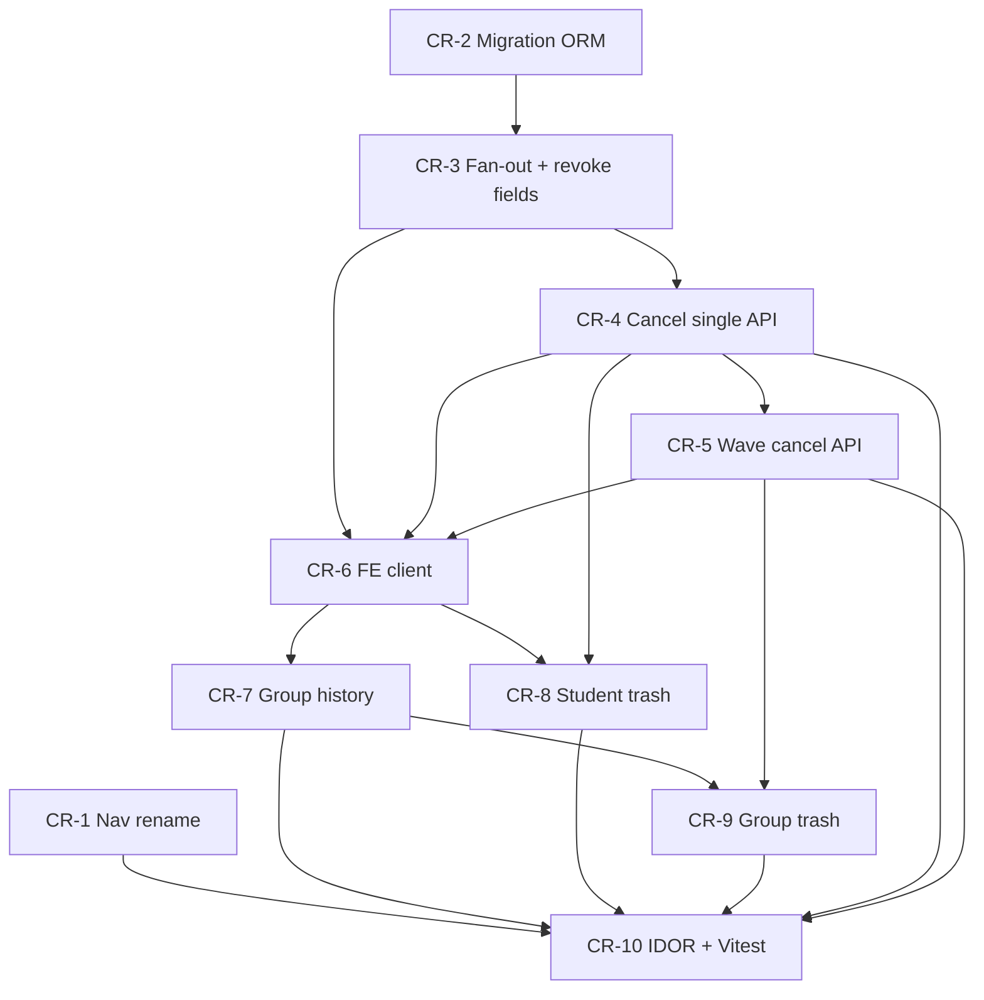

# Implementation Plan: Конструктор (nav) + отзыв ДЗ

> **PLAN from spec v0.1.0; if assumptions change after dual approve, update plan.**  
> Spec status: ✅ complete — CR-1…CR-10 implemented.

**Источник:** [`docs/specs/constructor-nav-and-homework-revoke.md`](../docs/specs/constructor-nav-and-homework-revoke.md) v0.1.0 · idea: [`docs/ideas/constructor-nav-and-homework-revoke.md`](../docs/ideas/constructor-nav-and-homework-revoke.md)  
**Дата плана:** 2026-07-24  
**Статус:** ✅ complete  
**Skills:** planning-and-task-breakdown → (after approve) incremental-implementation → TDD → frontend-ui-engineering  
**Коммиты:** только по явной просьбе пользователя  
**Baseline:** side panels shipped (`StudentSidePanel` / `GroupSidePanel`); templates + group fan-out + revoke-on-leave; `HomeworkStatus.CANCELLED` exists; no `assign_batch_id` / `cancelled_at` yet; TeacherNav still «Темы»

### Progress

| Task | Статус |
|------|--------|
| CR-1 Nav + themes copy «Конструктор» | ✅ done |
| CR-2 Migration + ORM: `assign_batch_id`, `cancelled_at` | ✅ done |
| CR-3 Fan-out batch_id + revoke sets `cancelled_at` + schema/mapper | ✅ done |
| CR-4 Cancel/restore API (single) + pytest | ✅ done |
| CR-5 Wave cancel/restore + pytest | ✅ done |
| CR-6 FE types + `cancelHomework` / `restoreHomework` client | ✅ done |
| CR-7 Group sheet: history waves | ✅ done |
| CR-8 Student sheet: trash + 30s undo toast | ✅ done |
| CR-9 Group sheet: wave trash + undo | ✅ done |
| CR-10 multi_teacher IDOR + Vitest sweep + manual smoke notes | ✅ done |

---

## Overview

Один MVP из трёх связанных срезов: (1) rename teacher nav/заголовков «Темы» → «Конструктор» / «Конструктор заданий» без смены URL `/teacher/themes` и без касания ученического `TestsPicker`; (2) в `GroupSidePanel` — история раздач **волнами** (`assign_batch_id`), с refresh после assign/cancel/restore; (3) явный отзыв корзиной (single у ученика, wave у группы) + `POST …/cancel` / `…/restore` с server TTL 30 с и toast «Вернуть» без confirm-модалки. Сданные (`submitted` / `reviewed`) не трогаем; ученику notify об отзыве не шлём.

---

## Architecture Decisions

| Решение | Выбор | Почему |
|---------|--------|--------|
| Ключ волны | Колонка `homework_assignments.assign_batch_id` (UUID nullable, index) | Spec Assump. 5; heuristic по `created_at` ломается при двух подряд assign одного шаблона |
| Когда писать batch_id | Только group fan-out: один UUID на все копии волны; individual assign → `null` | Одна строка в group UI = один batch; student sheet остаётся per-assignment |
| TTL undo | Колонка `cancelled_at` (timestamptz nullable); restore iff `status=cancelled` и `now - cancelled_at ≤ 30s` | Spec Assump. 12; клиентский таймер только UX; источник истины — сервер |
| Cancel семантика | Только `assigned` / `in_progress` → `cancelled` + `cancelled_at=now()`; hard-DELETE out | Как revoke-on-leave; teacher history сохраняет строку с меткой |
| Restore target | Всегда → `assigned` (не восстанавливаем `in_progress`) | Spec default Open Q1; прогресс items as-is |
| API shape | `POST /api/homework/{id}/cancel` и `…/restore`; optional body `{ "scope": "single" \| "wave" }` (default `single`) | Один path; wave требует `source_group_id` + `assign_batch_id` на anchor row |
| Wave cancel | Все siblings с тем же `teacher_id` + `assign_batch_id` в `assigned`/`in_progress`; response: `cancelled_ids`, `skipped_submitted_count`, `cancelled_at` | Spec US-CR-6; UI показывает counts |
| Wave restore | Restore ids из последнего cancel **или** cancelled siblings batch с `cancelled_at` в окне 30 с (default: same batch + TTL) | Spec Open Q2 default; FE передаёт `scope: "wave"` с тем же anchor id |
| Zero cancels | Prefer `200` с `cancelled_ids=[]` + skipped counts (не 409), кроме TTL/not-cancelled на restore → `409` | Меньше фронтовых special-cases; IDOR → 403/404 как у существующих homework endpoints |
| Revoke-on-leave / delete group | Тоже пишут `cancelled_at`; undo UI для них **не** в MVP | Spec Assump. 13 — консистентность поля |
| UI revoke | Только trash icon + `aria-label`; toast/`chem-callout` «Отозвано» + «Вернуть» 30 с; **без** confirm modal | Spec Assump. 8 |
| Group history data | Reuse `listHomework()` → filter `source_group_id === group.id` → group by `assign_batch_id` (null batch → не в wave list / или skip) | No new list endpoint; teacher list already includes cancelled |
| Deep-link | Wave row → `/teacher/homework/{anyIdFromBatch}` (prefer first) | Spec Assump. 7; removable later |
| Nav | Label «Конструктор»; `aria-label`/`title` «Конструктор заданий»; href `/teacher/themes` | Spec US-CR-1; student «Темы» untouched |
| Trash icon | Inline SVG in panels (no shared trash component found in FE) | Spec Open Q3 default |
| Notifications | No new type; student list already excludes `cancelled` | Spec Assump. 14 / US-CR-8 |

**Accepted assumptions (from spec §Assumptions — treat as locked unless human amends):** one MVP; batch_id + cancelled_at; trash+toast only; cancel only unsubmitted; wave cancels all unsubmitted in batch; TestsPicker «Темы» out; no IMPLEMENT until dual approve.

---

## Dependency graph

```
CR-1 Nav/themes rename (FE-only; parallel-safe anytime)
 │
CR-2 Alembic 020 + ORM fields
 │
 └── CR-3 Fan-out assign_batch_id + revoke cancelled_at + Pydantic/mapper
       │
       ├── CR-4 Cancel/restore single (+ pytest TTL)
       │     │
       │     └── CR-5 Wave cancel/restore (+ pytest partial-submitted)
       │           │
       │           └── CR-10 multi_teacher IDOR (can start after CR-4; finish after CR-5)
       │
       └── CR-6 FE types + API client
             │
             ├── CR-7 Group history waves (+ refresh after assign)
             │     │
             │     └── CR-9 Group trash + wave undo (needs CR-5 + CR-7)
             │
             └── CR-8 Student trash + undo (needs CR-4)
                   │
                   └── CR-10 Vitest sweep + manual smoke (after CR-1, CR-7–9)
```



**Safe parallel:** CR-1 anytime vs backend. After CR-6: CR-7 and CR-8 can run in parallel sessions.  
**Recommended sequential (one agent):** CR-1 → CR-2 → CR-3 → CR-4 → CR-5 → CR-6 → CR-7 → CR-8 → CR-9 → CR-10.

**Demo-минимум:** CR-2→CR-4→CR-6→CR-8 (teacher cancels one student HW with undo). Full MVP needs CR-5/7/9 + CR-1.

---

## Task List

### Phase 1: Quick FE rename + schema foundation

---

## Task CR-1: TeacherNav + themes headings → «Конструктор»

**Description:** Rename teacher nav label from «Темы» to «Конструктор»; add accessible name «Конструктор заданий» (`aria-label` and/or `title` on the link — match existing nav a11y patterns). Update `/teacher/themes` page heading and home CTA («Конструктор тем» → «Конструктор заданий» or short «Конструктор» where already short). Do **not** change URL `/teacher/themes`. Do **not** touch student `TestsPicker` «Темы». Update `TeacherNav.test.tsx`.

**Acceptance criteria:**
- [ ] `TeacherNav` visible label «Конструктор»; link still `/teacher/themes`
- [ ] Accessible name includes «Конструктор заданий» (queryable via `getByRole('link', { name: … })`)
- [ ] Themes list/home CTA copy aligned; no leftover sole nav sense of «Темы» on teacher chrome for this item
- [ ] Student TestsPicker «Темы» unchanged (spot-check / no file touch)

**Verification:**
- [ ] `cd frontend && npm run test -- TeacherNav`
- [ ] Manual: open `/teacher` + `/teacher/themes` — headings/CTA say конструктор заданий

**Dependencies:** None

**Files likely touched:**
- `frontend/components/layout/TeacherNav.tsx`
- `frontend/components/layout/TeacherNav.test.tsx`
- `frontend/app/teacher/themes/page.tsx`
- `frontend/app/teacher/page.tsx`
- optionally `frontend/app/teacher/themes/[id]/page.tsx` (kicker «Конструктор тем»)

**Estimated scope:** S

---

## Task CR-2: Alembic + ORM — `assign_batch_id`, `cancelled_at`

**Description:** New Alembic revision after `019` (e.g. `020_homework_assign_batch_cancelled_at.py`): nullable UUID `assign_batch_id` + index; nullable timestamptz `cancelled_at` on `homework_assignments`. Extend `HomeworkAssignment` model. Downgrade drops columns/index.

**Acceptance criteria:**
- [ ] `alembic upgrade head` / downgrade works on SQLite (tests) and existing dev DB
- [ ] ORM fields present and typed; existing rows remain valid (`null` batch / `null` cancelled_at)
- [ ] Index on `assign_batch_id` created

**Verification:**
- [ ] `cd backend && alembic upgrade head`
- [ ] `pytest tests/test_models.py -q` (extend smoke if useful)

**Dependencies:** None (sequentially before CR-3)

**Files likely touched:**
- `backend/alembic/versions/020_*.py` (new)
- `backend/app/models/homework.py`
- optionally `backend/scripts/repair_dev_db.py` if project keeps column checklist

**Estimated scope:** S

---

## Task CR-3: Fan-out writes `assign_batch_id`; revoke sets `cancelled_at`; expose in schemas/mapper

**Description:** On group assign in `homework_template_service`, generate one `uuid4` and set `assign_batch_id` on every created row; individual assign leaves `null`. Update `revoke_unsubmitted_for_students` / `revoke_all_unsubmitted` to set `cancelled_at=now()` alongside `status=cancelled`. Extend `HomeworkRead` (+ mapper) with `assign_batch_id`, `cancelled_at` (and ensure `source_group_id` / `template_id` already on read stay wired). pytest: fan-out shares one batch_id; revoke-on-leave sets `cancelled_at`.

**Acceptance criteria:**
- [ ] Group fan-out: N members → N assignments, identical non-null `assign_batch_id`
- [ ] Individual assign: `assign_batch_id is null`
- [ ] Member leave / delete group: unsubmitted → `cancelled` **and** `cancelled_at` not null
- [ ] `HomeworkRead` JSON includes new fields for teacher list/detail

**Verification:**
- [ ] `cd backend && pytest tests/test_homework_templates.py tests/test_teacher_groups.py -q`
- [ ] Extend assertions on batch_id / cancelled_at in those suites (or small focused tests)

**Dependencies:** CR-2

**Files likely touched:**
- `backend/app/services/homework_template_service.py`
- `backend/app/repositories/app/student_group_repo.py`
- `backend/app/schemas/homework.py`
- `backend/app/services/homework_mapper.py`
- `backend/tests/test_homework_templates.py`
- `backend/tests/test_teacher_groups.py`

**Estimated scope:** M

---

### Checkpoint: Foundation

- [ ] Migration applied; fan-out batch_id green
- [ ] Revoke-on-leave writes `cancelled_at`
- [ ] CR-1 Vitest green (rename can land in same or prior checkpoint)
- [ ] Review with human before cancel API if Assump. 5/12 still contested

---

### Phase 2: Cancel / restore API

---

## Task CR-4: Cancel + restore (single scope) + pytest

**Description:** Implement service + router endpoints `POST /api/homework/{assignment_id}/cancel` and `…/restore`. Default scope `single`: cancel this id if `assigned`/`in_progress`; set `cancelled` + `cancelled_at`. Restore: only if `cancelled` and within 30s → `assigned`, clear or keep `cancelled_at` (prefer clear/`null` on success — document in code). Authz: teacher owner only (same pattern as existing homework mutations). TDD in new `tests/test_homework_cancel.py`. Student list still excludes cancelled (regression).

**Acceptance criteria:**
- [ ] Cancel active → 200 with `cancelled_ids` (len 1), `cancelled_at` set
- [ ] Cancel submitted/reviewed → no status change; prefer empty `cancelled_ids` + skipped count (or documented 409 — pick one and test)
- [ ] Restore within 30s → `assigned`; after >30s → 409
- [ ] Non-owner / other teacher → 403/404 consistent with suite
- [ ] Student `GET /api/homework` still omits cancelled

**Verification:**
- [ ] `cd backend && pytest tests/test_homework_cancel.py -q`
- [ ] `pytest tests/test_homework_templates.py -q` (cancelled student visibility regression if covered)

**Dependencies:** CR-3

**Files likely touched:**
- `backend/app/services/homework_service.py` (or dedicated helper in existing service)
- `backend/app/api/routers/homework.py`
- `backend/app/schemas/homework.py` (CancelRequest, CancelResponse, RestoreResponse)
- `backend/app/repositories/app/homework_repo.py` (if needed)
- `backend/tests/test_homework_cancel.py` (new)

**Estimated scope:** M

---

## Task CR-5: Wave cancel / restore + pytest

**Description:** Extend cancel/restore with `scope: "wave"`. Anchor assignment must have `source_group_id` + `assign_batch_id`. Cancel all same-teacher siblings in batch with status assigned/in_progress; count skipped submitted/reviewed. Wave restore restores cancelled siblings of that batch still within TTL (same `cancelled_at` window / batch). Cover: 2 members → 2 cancelled; one submitted → 1 cancelled + skipped=1; wave restore within TTL.

**Acceptance criteria:**
- [ ] Wave cancel cancels all unsubmitted copies sharing `assign_batch_id`
- [ ] Submitted siblings untouched; `skipped_submitted_count` accurate
- [ ] Wave restore brings back only eligible cancelled ids within 30s
- [ ] Wave on individual (null batch) → 422 or documented error
- [ ] Single-scope still works unchanged

**Verification:**
- [ ] `cd backend && pytest tests/test_homework_cancel.py -q`
- [ ] Include time-freeze or monkeypatch clock for TTL if not already in CR-4

**Dependencies:** CR-4

**Files likely touched:**
- `backend/app/services/homework_service.py`
- `backend/app/api/routers/homework.py`
- `backend/tests/test_homework_cancel.py`

**Estimated scope:** M

---

### Checkpoint: Cancel API

- [ ] Single + wave + TTL + partial-submitted green in pytest
- [ ] OpenAPI/docs show new endpoints
- [ ] Human can curl cancel/restore before FE wiring

---

### Phase 3: Frontend — history + revoke UI

---

## Task CR-6: FE types + `cancelHomework` / `restoreHomework`

**Description:** Extend `HomeworkAssignment` in `lib/api/types.ts` with `assign_batch_id`, `cancelled_at`, and missing provenance fields needed for group filter (`source_group_id`, `template_id` if not already present — backend already returns them). Add `cancelHomework(id, scope?)` and `restoreHomework(id, scope?)` in `lib/api/homework.ts` matching API responses. Thin types for cancel/restore response.

**Acceptance criteria:**
- [ ] Types compile; fields optional/nullable as API
- [ ] Client posts JSON `{ scope }` when provided; credentials via existing `apiFetch`
- [ ] No business TTL logic in client beyond calling restore

**Verification:**
- [ ] `cd frontend && npx tsc --noEmit` (or project’s usual typecheck) if available; else rely on Vitest imports in later tasks
- [ ] Smoke: unit-testable mock of client in CR-8/9

**Dependencies:** CR-4 (contract); ideally CR-5 for wave scope typing

**Files likely touched:**
- `frontend/lib/api/types.ts`
- `frontend/lib/api/homework.ts`

**Estimated scope:** S

---

## Task CR-7: GroupSidePanel — homework history waves

**Description:** On panel open (and after successful assign), `listHomework()` → filter `source_group_id === group.id` → group by `assign_batch_id` into wave rows (title, due, status summary e.g. `2 уч. · 1 сдано · 1 активно`, cancelled label). Optional helper `lib/students/groupHomeworkWaves.ts`. Deep-link to `/teacher/homework/{firstId}`. Empty state when no waves. Mirror student sheet list UX patterns (no cards for decoration). Refresh list without closing panel after assign.

**Acceptance criteria:**
- [ ] After group assign, wave appears without closing sheet
- [ ] One wave row per `assign_batch_id` (not N student rows)
- [ ] Cancelled waves show «Отозвано»/«Отменено» style label like student history
- [ ] Loading / error states handled

**Verification:**
- [ ] `cd frontend && npm run test -- GroupSidePanel`
- [ ] Manual: `/teacher/students?tab=groups` → assign → history row visible

**Dependencies:** CR-3 (data), CR-6 (types)

**Files likely touched:**
- `frontend/components/students/GroupSidePanel.tsx`
- `frontend/components/students/GroupSidePanel.test.tsx` (create/extend)
- `frontend/lib/students/groupHomeworkWaves.ts` (optional new)
- `frontend/components/students/GroupsPanel.tsx` only if props plumbing needed (prefer keep self-contained)

**Estimated scope:** M

---

## Task CR-8: StudentSidePanel — trash + 30s undo toast

**Description:** On each cancellable homework row (`assigned` / `in_progress`), trash button with `aria-label` «Отозвать задание «{title}»». Click → `cancelHomework(id)` (single); refresh list; show `role="status"` callout «Отозвано» + «Вернуть» for 30s client timer; «Вернуть» → `restoreHomework(id)`; on 409 show brief error and dismiss undo. No confirm modal. Cancelled rows: no trash (or disabled). Inline SVG trash.

**Acceptance criteria:**
- [ ] Trash only on active unsubmitted rows
- [ ] Cancel → row shows cancelled; undo visible ≤30s
- [ ] Restore within window → back to assigned in list
- [ ] a11y: button named; undo in `role="status"`

**Verification:**
- [ ] `cd frontend && npm run test -- StudentSidePanel`
- [ ] Manual: cancel → student no longer sees HW; restore &lt;30s → visible again

**Dependencies:** CR-4, CR-6

**Files likely touched:**
- `frontend/components/students/StudentSidePanel.tsx`
- `frontend/components/students/StudentSidePanel.test.tsx` or `StudentList.test.tsx` (whichever owns panel tests)

**Estimated scope:** M

---

## Task CR-9: GroupSidePanel — wave trash + undo

**Description:** Trash on active wave rows → `cancelHomework(anchorId, "wave")`; show counts from response in toast/status (cancelled vs skipped submitted); refresh waves; undo → `restoreHomework(anchorId, "wave")` within 30s. Cancelled-only waves: no trash. Keep assign success callout pattern; undo can reuse same `chem-callout` area carefully (one status at a time or stacked simply).

**Acceptance criteria:**
- [ ] Wave trash cancels all unsubmitted members’ copies
- [ ] UI reflects skipped submitted count when partial
- [ ] Undo restores eligible cancelled siblings within 30s
- [ ] List refreshes without closing panel

**Verification:**
- [ ] `cd frontend && npm run test -- GroupSidePanel`
- [ ] Manual: 2-member group, one submitted — cancel wave → one cancelled, one intact; undo restores cancelled

**Dependencies:** CR-5, CR-6, CR-7

**Files likely touched:**
- `frontend/components/students/GroupSidePanel.tsx`
- `frontend/components/students/GroupSidePanel.test.tsx`

**Estimated scope:** M

---

### Checkpoint: UI revoke

- [ ] Student + group trash + undo Vitest green
- [ ] Group history + refresh after assign/cancel/restore
- [ ] Manual smoke path below started

---

### Phase 4: Hardening + closeout

---

## Task CR-10: multi_teacher IDOR + Vitest sweep + manual smoke notes

**Description:** Add multi_teacher tests: teacher B cannot cancel/restore teacher A’s assignment (single and wave). Sweep Vitest for TeacherNav, StudentSidePanel, GroupSidePanel. Document manual smoke checklist in this plan’s checkpoint (do not require Playwright unless already set up). Confirm revoke-on-leave still sets `cancelled_at`. No student notify regression (no new notification type).

**Acceptance criteria:**
- [ ] IDOR cases in `tests/multi_teacher/` green
- [ ] Targeted frontend tests green
- [ ] Spec §8 success criteria checkboxes can be marked during IMPLEMENT (not yet)
- [ ] Manual smoke notes listed for human

**Verification:**
- [ ] `cd backend && pytest tests/test_homework_cancel.py tests/test_homework_templates.py tests/test_teacher_groups.py tests/multi_teacher/ -q`
- [ ] `cd frontend && npm run test -- TeacherNav StudentSidePanel GroupSidePanel`
- [ ] `cd frontend && npm run lint`

**Dependencies:** CR-1, CR-5, CR-8, CR-9

**Files likely touched:**
- `backend/tests/multi_teacher/test_isolation.py` (or new `test_homework_cancel_isolation.py`)
- FE tests as needed for gaps
- this plan Progress table (update during IMPLEMENT)

**Estimated scope:** M

---

### Checkpoint: Complete (after dual approve + all tasks)

- [x] All Progress rows ✅
- [x] Spec §8 success criteria met
- [ ] Ready for code-review-and-quality
- [ ] Manual smoke:

  1. Nav shows «Конструктор»; themes page copy ok  
  2. Assign template to group → wave in group sheet  
  3. Trash wave → student list loses HW; teacher sees «Отозвано»  
  4. «Вернуть» &lt;30s → HW back  
  5. Wait &gt;30s → restore fails / undo gone  
  6. Student TestsPicker still «Темы»

---

## Risks and Mitigations

| Risk | Impact | Mitigation |
|------|--------|------------|
| Legacy group assignments without `assign_batch_id` | Med | History: only group rows with non-null batch_id as waves; optional later backfill out of MVP; document empty history for old fan-outs |
| FE types missing `source_group_id` today | Med | CR-6 adds provenance fields explicitly; filter otherwise broken |
| Clock skew / flaky TTL tests | Med | Freeze time in pytest (`freezegun` or patch `datetime.now`) |
| Route ordering `/cancel` vs other `/{id}/…` | Low | Mirror existing `submit`/`reopen` path style on same router |
| Undo toast vs assign success callout clash | Low | Single status slot or clear assign success on cancel |
| Wave restore ambiguity (response ids vs batch+TTL) | Low | Lock Open Q2 default in CR-5 tests; FE uses same `scope: wave` + anchor |
| Accidental touch of student TestsPicker | Low | CR-1 acceptance: no file change; grep «Темы» in TestsPicker unchanged |
| Large panel diffs | Med | Keep CR-7 history before CR-9 trash; separate Vitest cases |

---

## Open Questions

From spec §10 — **non-blocking** if defaults kept (plan assumes these):

1. **Restore after `in_progress`:** always → `assigned` (default) — or restore previous `in_progress`?
2. **Wave undo:** restore ids from last cancel response vs all cancelled siblings in batch with `cancelled_at` within 30s? → **Plan default:** batch + TTL (server), FE passes `scope: "wave"`.
3. **Trash icon:** shared component vs inline SVG? → **Plan default:** inline SVG (none found in FE).

**Blockers for IMPLEMENT:** dual human approve of **spec** (still draft) **and** this **plan**. No other technical blockers identified.

---

## Out of scope (do not pull in)

- Hard delete; GroupAssignment entity; student notify on revoke; rename `/teacher/themes` path; student «Темы» tab; ambient-background / other open specs; per-member checkbox revoke inside a wave.

---

## Notes for implementer

- Follow TDD on CR-4/CR-5 first (failing pytest → service → router).
- After each task: green verification commands above; leave system runnable (`uvicorn` + `npm run dev`).
- Do not commit unless user asks.
- If Assump. 5 rejected for heuristic grouping — stop and re-plan (migration task shrinks, wave logic changes).
